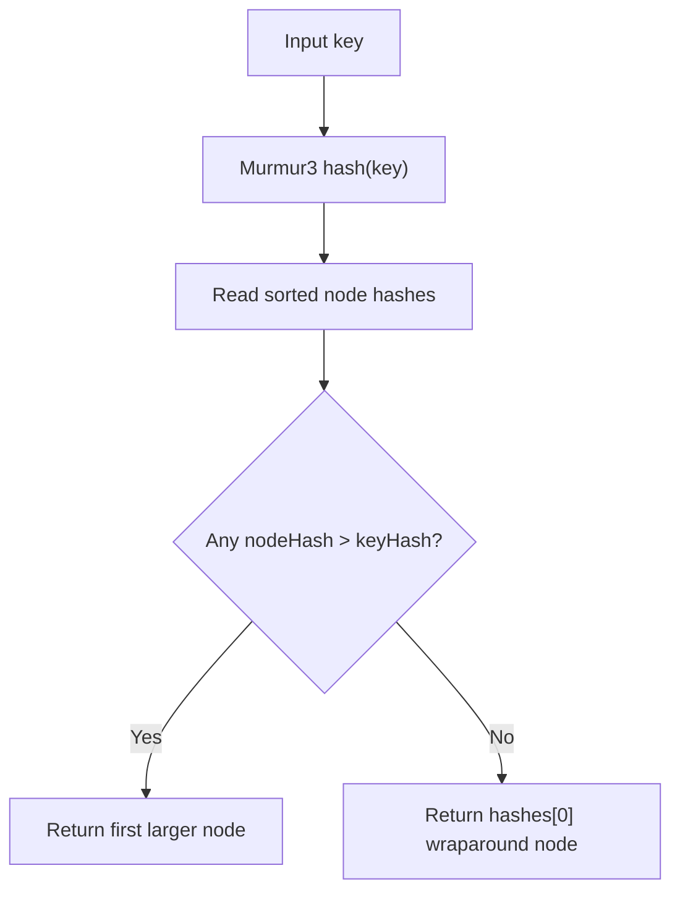
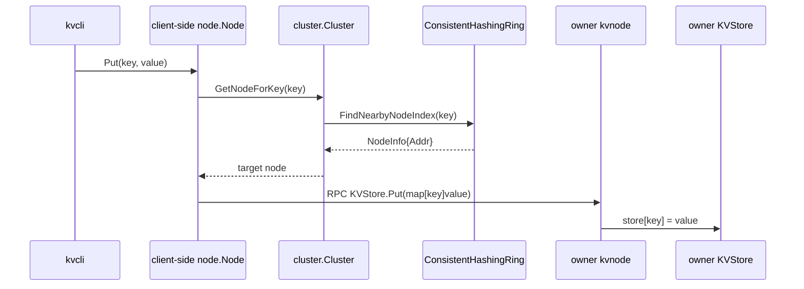
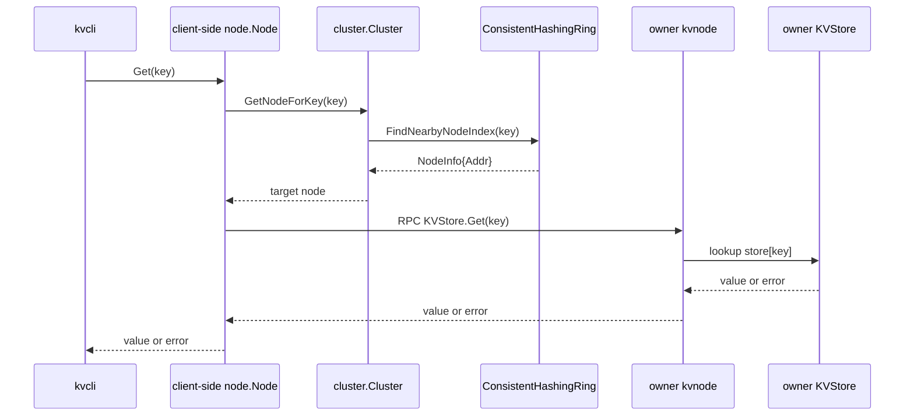
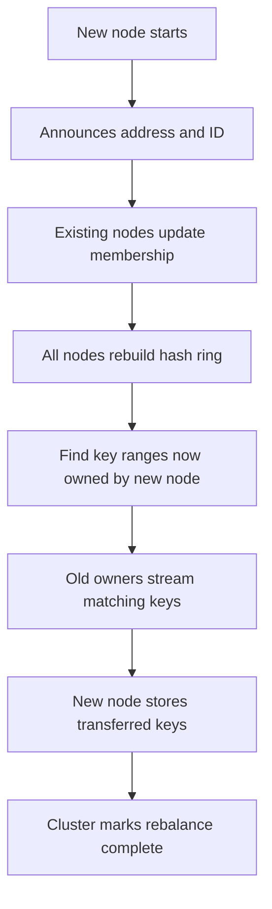
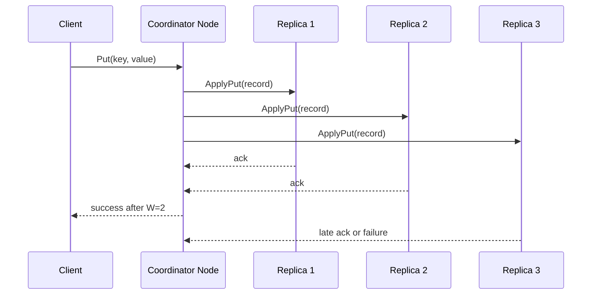
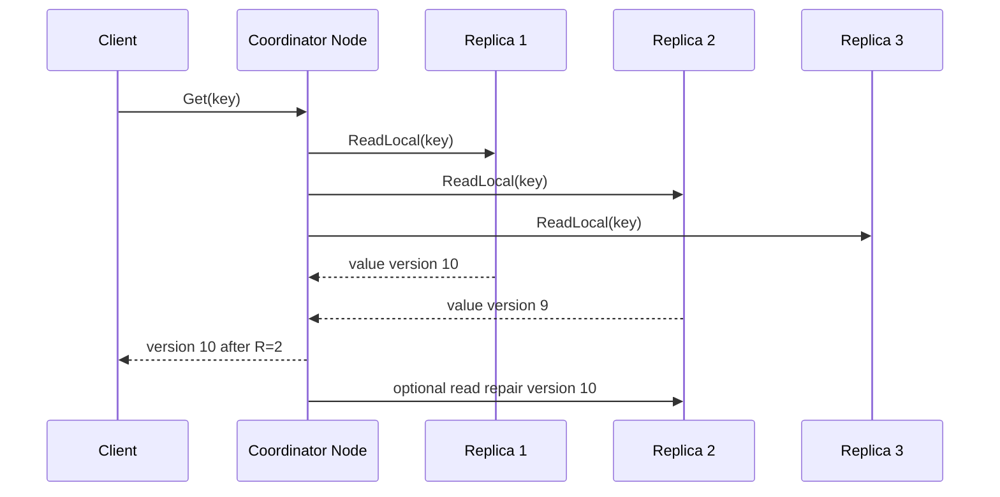
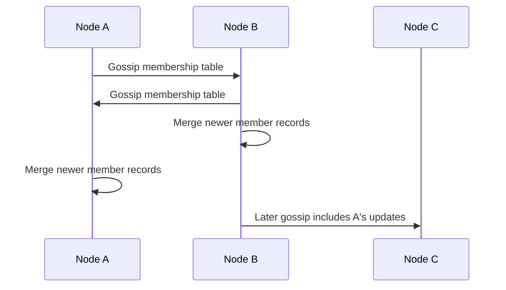
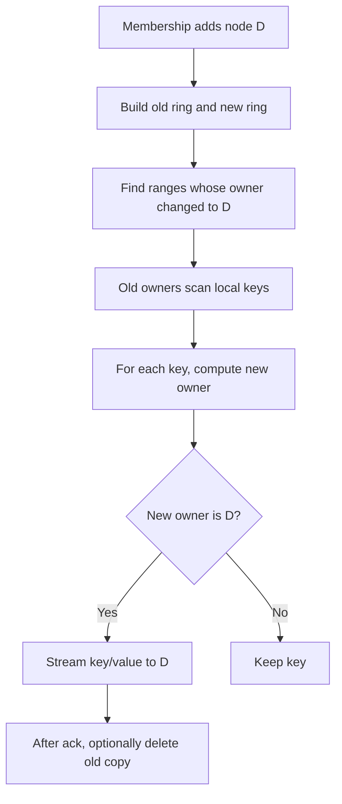
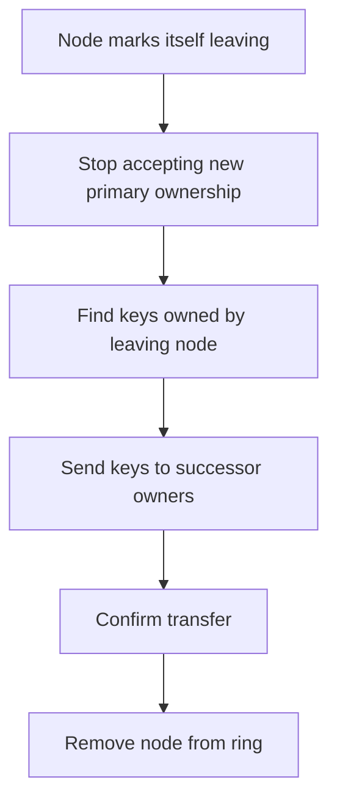
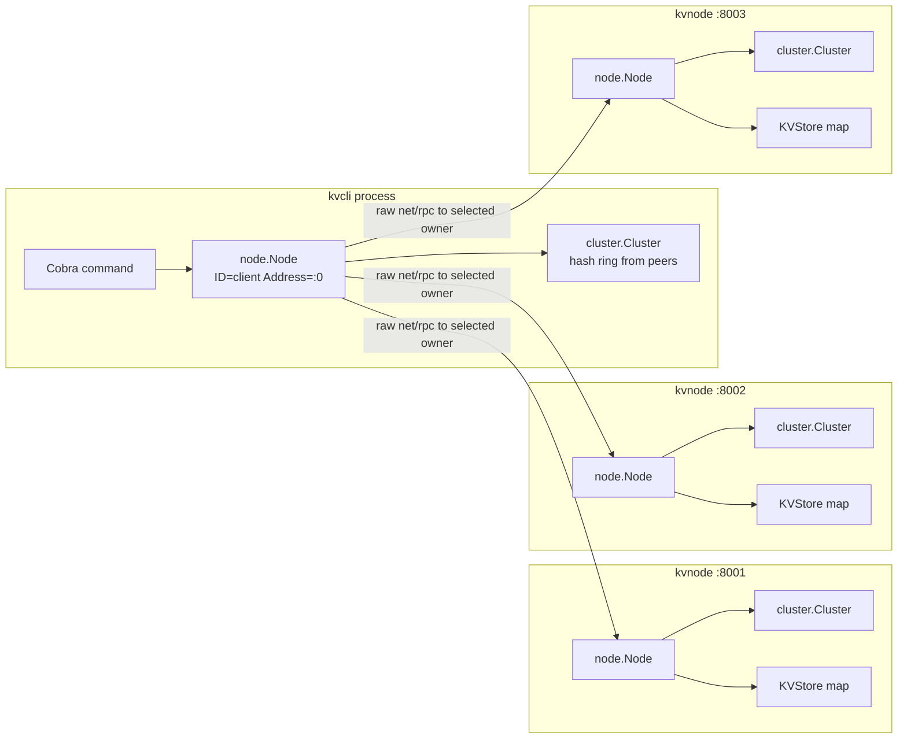

# kvStore Contributor Guide

This guide focuses on the distributed-systems parts of this project: consistent hashing, key ownership, node membership, failure scenarios, and how to extend the current implementation toward replication, quorum reads/writes, gossip membership, and rebalancing.

The current implementation is intentionally minimal. It has static membership, a single owner for each key, raw Go RPC forwarding, and an in-memory map. Treat the future-looking sections as implementation guidance, not as descriptions of existing behavior.

## Current Consistent Hashing Implementation

### First Principles

A distributed key-value store needs a deterministic way to answer this question:

> Which node is responsible for this key?

If every client and every node can answer that question from the same cluster membership list, requests can be routed without a central coordinator.

The project answers that question with a hash ring.

Conceptually:

```text
uint32 hash space:

0 ---------------------------------------------------------- max uint32
|              |                    |                 |
node-2         node-1               key:user:42       node-3

Key goes to the first node clockwise after the key hash.
In this example: user:42 -> node-3
```

If the key hash is greater than every node hash, the ring wraps around:

```text
0 ---------------------------------------------------------- max uint32
|              |                    |                         |
node-2         node-1               node-3                    key

No node appears after key, so wrap to first node:
key -> node-2
```

### Where It Lives

Files:

- `internal/cluster/hash.go`
- `internal/cluster/cluster.go`

Core types:

```go
type NodeInfo struct {
    ID   string
    Addr string
}

type ConsistentHashingRing struct {
    mu     sync.RWMutex
    nodes  map[uint32]*NodeInfo
    hashes []uint32
}
```

The ring keeps two structures:

1. `nodes`: maps a node hash to its node metadata.
2. `hashes`: stores all node hashes in sorted order.

The sorted slice makes ownership lookup straightforward: scan from low to high until the first node hash greater than the key hash.

### Hash Function

File: `internal/cluster/hash.go`

```go
func hashFunction(key string) uint32 {
    return murmur3.Sum32([]byte(key))
}
```

The project uses Murmur3. Murmur3 is a fast non-cryptographic hash function. It is useful for distribution, not security.

### Adding A Node To The Ring

File: `internal/cluster/hash.go`

```go
func (chr *ConsistentHashingRing) AddNode(id string, addr string) {
    chr.mu.Lock()
    defer chr.mu.Unlock()

    hash := hashFunction(id)

    chr.nodes[hash] = &NodeInfo{
        ID:   id,
        Addr: addr,
    }

    chr.hashes = append(chr.hashes, hash)
    slices.Sort(chr.hashes)
}
```

What this does:

1. Locks the ring for mutation.
2. Hashes the node ID.
3. Stores node metadata at that hash point.
4. Appends the hash to the sorted hash list.
5. Sorts the list.

Important detail: in the current startup path, these IDs are generated by `NewCluster`, not taken from `--id`.

### Building The Cluster View

File: `internal/cluster/cluster.go`

```go
func NewCluster(selfAddr string, peerAddrs []string) *Cluster {
    chr := NewConsistentHashingRing()
    for i, addr := range append(peerAddrs, selfAddr) {
        chr.AddNode(fmt.Sprintf("node-%d", i+1), addr)
    }

    return &Cluster{
        ring: chr,
        self: &NodeInfo{Addr: selfAddr},
    }
}
```

This means the ring is built from addresses, but the hash position is based on generated IDs:

- first address becomes `node-1`
- second address becomes `node-2`
- third address becomes `node-3`

Contributor warning: if different processes build the address list in different orders, the same physical address may get a different generated ID. That can make nodes disagree about ownership.

### Finding The Owner For A Key

File: `internal/cluster/hash.go`

```go
func (chr *ConsistentHashingRing) FindNearbyNodeIndex(key string) (*NodeInfo, error) {
    chr.mu.RLock()
    defer chr.mu.RUnlock()

    if len(chr.hashes) == 0 {
        return nil, errors.New("no nodes in the ring")
    }

    h := hashFunction(key)

    for _, nodeHash := range chr.hashes {
        if nodeHash > h {
            return chr.nodes[nodeHash], nil
        }
    }

    return chr.nodes[chr.hashes[0]], nil
}
```

Algorithm:

1. Hash the key.
2. Walk the sorted node hashes.
3. Return the first node whose hash is greater than the key hash.
4. If none is greater, wrap to the first node.

Diagram:



## How Keys Are Mapped To Nodes

### End-To-End Put Mapping

Files:

- `cmd/kvcli/cli.go`
- `internal/node/node.go`
- `internal/cluster/cluster.go`
- `internal/cluster/hash.go`
- `internal/node/handler.go`

Flow:



`Node.Put` is the routing point:

```go
func (n *Node) Put(key, value string) error {
    targetNode := n.cluster.GetNodeForKey(key)
    if targetNode.Addr == n.Address {
        args := map[string]string{key: value}
        var reply bool
        return n.kvStore.Put(args, &reply)
    }

    client, err := dialRPC(targetNode.Addr)
    ...
    return client.Call("KVStore.Put", args, &reply)
}
```

If the selected owner is local, it writes directly. Otherwise, it dials the owner.

### End-To-End Get Mapping

Flow:



`Node.Get` mirrors `Node.Put`, except the RPC method is `KVStore.Get`.

## How Node Joins Work Today

Runtime node joins are not implemented.

The only "join" process is startup-time static membership:

1. The operator starts each node manually.
2. Each node receives a `--peers` list.
3. Each node builds its own ring from that list.
4. There is no network handshake to join.
5. There is no data movement from old owners to the new node.

Startup example from the README:

```text
go run ./cmd/kvnode --id=node-1 --addr=:8001 --peers=:8001,:8002,:8003
go run ./cmd/kvnode --id=node-2 --addr=:8002 --peers=:8001,:8002,:8003
go run ./cmd/kvnode --id=node-3 --addr=:8003 --peers=:8001,:8002,:8003
```

Important nuance:

- In `cmd/kvnode`, the node removes its own address from `peers` and passes `others` plus `self` to `NewCluster`.
- In `cmd/kvcli`, the first peer is treated as `self` and the remaining addresses are `others`.
- `NewCluster` appends `selfAddr` after `peerAddrs`.

That means the final address order used for generated ring IDs can differ between server nodes unless the construction produces the same final list everywhere.

### What A Real Join Would Need

A runtime join requires more than calling `AddNode`.

Minimum pieces:

1. A membership protocol or admin API to announce the new node.
2. A way for all existing nodes to update their ring.
3. A rebalancing process to move keys whose ownership changed.
4. A safety rule for writes during rebalancing.
5. Observability to know when the join is complete.

Join diagram:



## How Node Leaves Work Today

Runtime node leaves are not implemented.

The ring has `RemoveNode(id string)`, but no active application path calls it. There is no graceful leave command, no membership broadcast, and no data transfer.

If a node process stops:

- Other nodes do not remove it from their rings.
- Clients still route keys to its address.
- Requests for keys owned by that node fail to connect.
- Its in-memory data is lost.

### What A Real Leave Would Need

Graceful leave:

1. Node announces it is leaving.
2. Cluster marks it as draining.
3. Writes to affected key ranges are blocked, redirected, or replicated.
4. Leaving node streams owned keys to successor nodes.
5. Other nodes remove it from the ring after transfer.

Failure leave:

1. Failure detector marks node suspect.
2. After timeout, marks node dead.
3. Cluster removes it from routing.
4. If replication exists, remaining replicas repair or promote ownership.
5. If replication does not exist, keys owned only by the failed node are lost.

## Failure Scenarios

### Owner Node Is Down

Current behavior:

1. Client computes owner.
2. `dialRPC(ownerAddr)` attempts TCP connection.
3. If connection fails, `Node.Put` or `Node.Get` returns an error.
4. No alternate node is tried.

Why:

- There is no replication.
- There is no live membership update.

Contributor implication:

- Adding retries alone does not fix owner failure. You need replicas or membership changes.

### Non-Owner Node Is Down

Current behavior:

- Requests for keys owned by live nodes can still work if the client routes directly to those live owners.
- Requests for keys owned by the down node fail.

Because the CLI computes ownership itself, it does not need to contact a random gateway node first.

### Peer List Mismatch

Current behavior:

- Node A and Node B may build different rings.
- The same key may map to different owners.
- A put can succeed on one owner, then a get can ask another owner and fail.

This is one of the most important correctness risks in the current design.

To reduce this risk:

- Make peer list ordering canonical.
- Use stable configured node IDs.
- Add tests proving all startup paths build the same ring.

### Restart

Current behavior:

- Restarted node loses all keys because storage is in memory.
- Other nodes do not know it restarted.
- The ring still maps the same keys to it.

### Slow Or Hung Node

Current behavior:

- `dialRPC` has a 2 second connection timeout.
- After connection, `rpc.Client.Call` has no explicit per-call deadline.

Contributor implication:

- If you need robust timeouts, you need a transport or wrapper that supports request deadlines, or call RPC in a goroutine with cancellation semantics.

### Transport Mismatch

Current behavior:

- Active server: raw RPC.
- Active CLI routing: raw RPC.
- `pkg/client` and `Peer.SendPut`: HTTP RPC.

Risk:

- A contributor may try to use `pkg/client` and see connection/protocol errors.

Fix direction:

- Either change `pkg/client` and `Peer` to raw RPC, or change `Node.Serve` to serve HTTP RPC.

## How Replication Could Be Added

Replication means storing each key on more than one node.

### First Principles

The current ring gives one owner:

```text
key -> primary node
```

With replication factor `N`, the ring should give:

```text
key -> primary node + next N-1 distinct nodes clockwise
```

Example with replication factor 3:

```text
ring order:
node-A -> node-B -> node-C -> node-D -> node-E

key maps to node-C
replicas: node-C, node-D, node-E
```

If the key maps near the end, wrap around:

```text
key maps to node-E
replicas: node-E, node-A, node-B
```

### Files To Modify

- `internal/cluster/hash.go`
- `internal/cluster/cluster.go`
- `internal/node/node.go`
- `internal/node/handler.go`

### Add Replica Selection

Add a method on the ring:

```go
func (chr *ConsistentHashingRing) FindReplicaNodes(key string, count int) ([]*NodeInfo, error)
```

Behavior:

1. Find primary owner index.
2. Walk clockwise through `hashes`.
3. Collect distinct physical nodes.
4. Wrap around as needed.
5. Stop after `count` nodes or after all nodes are included.

If virtual nodes are added later, "distinct physical nodes" becomes critical. Without that, the same physical node may appear multiple times.

### Add Write Fanout

Current write:

```text
Node.Put -> one owner -> KVStore.Put
```

Replicated write:

```text
Node.Put -> replica set -> KVStore.PutReplica on each replica
```

Recommended distinction:

- `Node.Put`: client-facing route-and-coordinate operation.
- `KVStore.Put`: local storage operation.
- Optional new RPC method: `KVStore.PutReplica` or `KVStore.ApplyPut`.

Avoid calling `Node.Put` on replicas for internal replication. That would recompute ownership and may route away from the intended replica.

### Add Read Strategy

Options:

1. Primary-only read: simple, but unavailable if primary is down.
2. Any-replica read: more available, but can return stale data.
3. Quorum read: reads from multiple replicas and resolves versions.

Without version metadata, quorum reads cannot reliably decide which value is newest.

### Add Versioning

To support replicated reads, store metadata:

```go
type ValueRecord struct {
    Value     string
    Version   uint64
    UpdatedAt time.Time
}
```

For a real distributed system, a single local counter is not enough across multiple coordinators. You would need a version strategy such as:

- primary-assigned monotonically increasing version
- hybrid logical clocks
- vector clocks
- consensus-backed log index

Do not introduce quorum reads without deciding how conflicts are resolved.

## How Quorum Reads/Writes Could Be Added

### First Principles

Quorum is a rule for how many replicas must agree before an operation succeeds.

Common notation:

- `N`: replication factor
- `W`: write quorum
- `R`: read quorum

If `R + W > N`, a successful read quorum overlaps with a successful write quorum. That overlap is what lets reads see recent writes, assuming version comparison is correct.

Example:

```text
N = 3
W = 2
R = 2

Write succeeds after 2 replicas acknowledge.
Read queries 2 replicas.
Any read set of 2 overlaps with any write set of 2.
```

### Write Quorum Flow



Implementation requirements:

1. Replica selection method.
2. Request type containing key, value, and version.
3. Coordinator logic that sends to all replicas.
4. Acknowledgement counting.
5. Timeout handling.
6. Error reporting for insufficient acknowledgements.

### Read Quorum Flow



Implementation requirements:

1. Local read RPC that does not reroute.
2. Versioned records.
3. Conflict resolution rule.
4. Optional read repair.

### Files To Modify

- `internal/node/handler.go`: store versioned records instead of raw strings.
- `internal/node/node.go`: coordinate quorum reads/writes.
- `internal/cluster/hash.go`: return replica sets.
- `cmd/kvnode/main.go`: configure replication factor/quorum values.
- `cmd/kvcli/cli.go`: possibly expose consistency options.

### Pitfalls

- Acknowledgement count is not enough without versioning.
- If write succeeds with `W=2` and the third replica misses it, read repair or hinted handoff may be needed.
- Quorum does not solve permanent data loss if too many replicas fail.
- Quorum reads can still return stale data if clocks/versions are wrong.

## How Gossip Membership Could Be Added

### First Principles

Static membership does not scale operationally. Every node currently needs the full peer list at startup, and no node learns when another node joins, leaves, or fails.

Gossip solves this by having nodes periodically exchange membership state with a few peers.

Each node maintains a table like:

```text
node id | address | status | incarnation | last seen
node-1  | :8001   | alive  | 4           | t1
node-2  | :8002   | suspect| 7           | t2
node-3  | :8003   | alive  | 2           | t3
```

The key idea: nodes do not need to talk to everyone on every tick. Information spreads through random peer exchanges.

### Suggested New Package

Create a package such as:

```text
internal/membership
```

Potential types:

```go
type MemberStatus string

const (
    StatusAlive   MemberStatus = "alive"
    StatusSuspect MemberStatus = "suspect"
    StatusDead    MemberStatus = "dead"
    StatusLeaving MemberStatus = "leaving"
)

type Member struct {
    ID          string
    Addr        string
    Status      MemberStatus
    Incarnation uint64
    LastSeen    time.Time
}
```

### Gossip Flow



### Merge Rule

A simple merge rule:

1. Member records are keyed by node ID.
2. Higher incarnation number wins.
3. If incarnation is equal, stronger status order can win, such as `alive < suspect < dead`.
4. `LastSeen` updates when a direct ping succeeds.

### Failure Detection

A basic failure detector:

1. Periodically ping known alive nodes.
2. If ping fails, mark suspect.
3. Gossip suspect state.
4. If no alive update arrives before timeout, mark dead.
5. Rebuild routing ring from alive nodes.

### Files To Modify

- `cmd/kvnode/main.go`: configure seed peers and gossip interval.
- `internal/node/node.go`: start/stop gossip loop and expose gossip RPC.
- `internal/cluster/cluster.go`: rebuild ring from live members.
- new `internal/membership` package.

### Pitfalls

- Network partitions can make alive nodes appear dead.
- Removing a node from the ring changes key ownership.
- Without replication, removing a failed node loses its keys.
- Gossip gives eventual convergence, not instant agreement.

## How Rebalancing Could Be Implemented

### First Principles

When membership changes, ownership changes.

If a new node joins, it becomes responsible for some keys that are currently stored on existing nodes. Those keys must move.

If a node leaves, keys it owns must move to successors.

Current storage does not track key ranges explicitly. It only stores a map, so rebalancing would need to scan keys and ask the ring who owns each one under the new membership.

### Join Rebalancing

Suppose node D joins:

```text
Before:
A -> B -> C

After:
A -> B -> D -> C
```

Only keys in D's new range should move to D. In a consistent hash ring, adding a node usually moves keys from D's successor to D.

High-level flow:



### Leave Rebalancing

Graceful leave:



Failure leave:

- Without replication, there is no source for lost data.
- With replication, surviving replicas can promote or copy data to restore replication factor.

### Required Storage APIs

Rebalancing needs APIs not currently present:

1. List local keys.
2. Read local key without routing.
3. Write local key without routing.
4. Delete local key after confirmed transfer.
5. Possibly stream batches instead of one key at a time.

Potential local methods:

```go
func (kv *KVStore) Snapshot() map[string]string
func (kv *KVStore) Delete(key string, reply *bool) error
```

For large stores, returning a full map is not acceptable. A cursor or streaming mechanism would be better.

### Write Safety During Rebalance

Naive rebalancing can lose writes:

1. Old owner scans key `x`.
2. Client writes new value for `x` to old owner.
3. Rebalance sends old value to new owner.
4. Ownership flips.
5. New owner has stale value.

Ways to handle this:

- Pause writes for moving ranges.
- Dual-write to old and new owners during transition.
- Use versioned records and replay missed writes.
- Use consensus/log replication for the range.

For this project, the simplest educational approach is:

1. Mark range as moving.
2. Route writes for moving keys to both old and new owners.
3. Transfer snapshot.
4. Flip ownership.
5. Stop dual-write after confirmation.

## Recommended Contribution Path

### First Contribution: Tests

Add tests before changing behavior:

- `ConsistentHashingRing` lookup and wraparound.
- `RemoveNode`.
- `KVStore.Get` missing key.
- `KVStore.Put` writes multiple keys.

This gives future contributors confidence when adding replication and membership.

### Second Contribution: Transport Cleanup

Choose one:

1. Raw RPC everywhere.
2. HTTP RPC everywhere.

Raw RPC is closest to the current active path. That means updating `pkg/client` and `Peer.SendPut` away from `rpc.DialHTTP`.

### Third Contribution: Stable Node Identity

Change cluster construction so node IDs are explicit and consistent across processes.

Current risk:

```go
chr.AddNode(fmt.Sprintf("node-%d", i+1), addr)
```

Better model:

```go
type Member struct {
    ID   string
    Addr string
}
```

Then build the ring from `[]Member`.

### Fourth Contribution: Replica Selection Without Writes

Before implementing replication, add and test:

```go
GetReplicaNodesForKey(key string, count int) []*NodeInfo
```

This isolates the ring logic from storage and RPC complexity.

### Fifth Contribution: Local Delete

Delete is useful for rebalancing and future TTL support.

Add:

- `KVStore.Delete`
- `Node.Delete`
- CLI `delete`

### Sixth Contribution: Replication

Add replication only after stable identity and replica selection are tested.

Start with a simple mode:

- replication factor 2 or 3
- write all replicas
- read primary

Then evolve toward quorum.

## Contributor Checklists

### Before Changing Routing

- Do all nodes build the same ring from the same membership?
- Are node IDs stable?
- Does the change alter ownership of existing keys?
- Is data movement required?
- Are tests covering wraparound?

### Before Changing RPC

- Are server and client using the same transport?
- Are method signatures valid for `net/rpc`?
- Are local direct calls and remote RPC calls using the same semantics?
- Do errors include enough context?

### Before Changing Storage

- Is the map lock still protecting all access?
- Does the change require persistence?
- Does the change affect RPC request/response types?
- Are missing-key semantics still clear?

### Before Adding Distributed Features

- What is the membership source of truth?
- What happens if a node fails mid-operation?
- What happens if two nodes disagree?
- What is the consistency model?
- What data can be lost?
- How will this be tested with multiple nodes?

## Current System In One Diagram



The central rule to remember:

> The hash ring decides ownership. `Node.Put` and `Node.Get` enforce that ownership by either using local storage or forwarding to the selected address.

When adding new features, keep asking whether the feature is changing:

- membership
- ownership
- local storage
- network transport
- consistency guarantees
- failure behavior

That question will usually tell you which package should change first.
