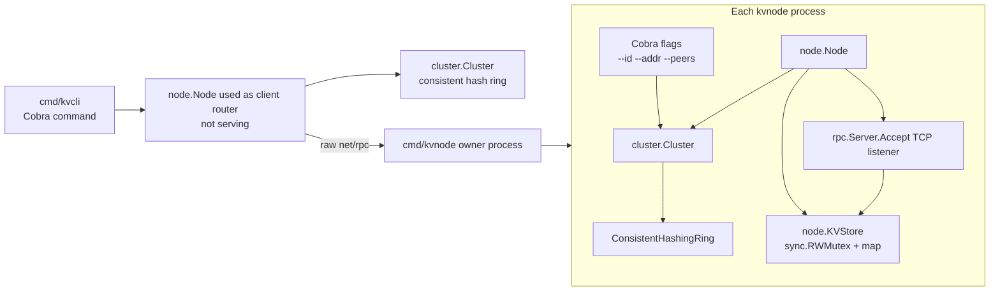
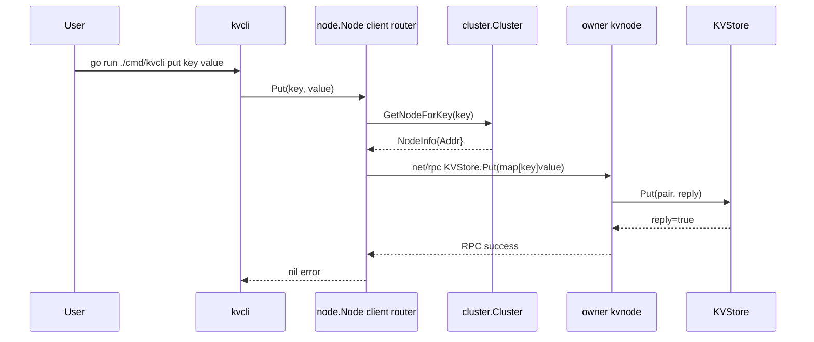
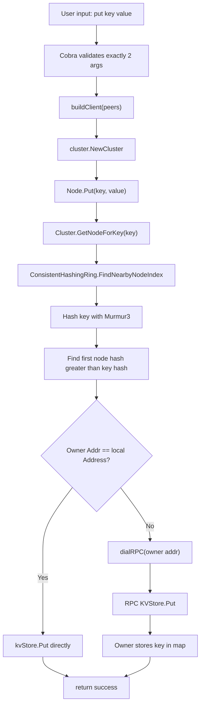
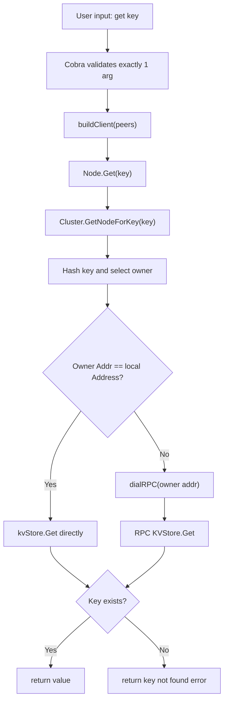

# kvStore Learning Guide

This document is a maintainer-oriented walkthrough of the current codebase. It documents what exists in the repository today, not the larger system the project may eventually become.

The current project is intentionally small: a Go-based distributed key-value store demo with static cluster membership, consistent hashing, in-memory storage, and Go `net/rpc` request forwarding. It is educational infrastructure for learning routing, ownership, and the basic shape of a distributed key-value store.

## Section 1: Project Overview

### What Problem This Project Solves

`kvStore` stores string keys and string values across multiple node processes. The main distributed-systems problem it demonstrates is: given a key and a list of nodes, how does every process independently choose the same owner for that key?

The answer in this project is a consistent hashing ring:

1. Each node is assigned a point on a hash ring.
2. Each key is hashed to a point on the same ring.
3. The key belongs to the first node clockwise after the key hash.
4. If the hash passes the end of the ring, ownership wraps around to the first node.

This lets clients and nodes route operations without a central coordinator.

The current implementation is intentionally minimal:

- Values are held only in memory.
- Each key has one owner.
- There is no replication.
- There is no disk persistence.
- There is no quorum read/write path.
- There is no runtime membership change.
- There is no gossip or failure detector.
- There is no consensus.

Those concepts appear in the README as future work, but they are not implemented.

### Who The Users Are

There are two practical users:

1. Learners who want to run a small cluster and see key routing in action.
2. Developers extending the project into a more complete distributed key-value store.

The project does not currently expose a production-grade client API. There is a CLI under `cmd/kvcli`, plus an unused `pkg/client` package. The CLI is the supported interaction path described by the README.

### What Happens When The Application Starts

There are two binaries:

- `kvnode`: starts a node server.
- `kvcli`: sends `put` and `get` commands into the cluster.

When `kvnode` starts:

1. Cobra parses flags from the command line.
2. The process validates that `--addr` and `--peers` are present.
3. The comma-separated peers string is split.
4. The node removes its own address from the peer list.
5. `cluster.NewCluster(self, others)` builds a consistent hash ring.
6. `node.NewNode(id, addr, r)` creates a node with a local `KVStore`.
7. `Node.Serve()` registers the local `KVStore` as an RPC service.
8. The node listens on the configured TCP address.
9. The RPC server accepts connections forever.

When `kvcli` starts:

1. Cobra parses the `put` or `get` subcommand.
2. The CLI builds a local, non-serving `node.Node` using the peer list.
3. That local `Node` computes the owner for the key.
4. If the owner address is not the CLI node address `:0`, it dials the owner.
5. It calls `KVStore.Put` or `KVStore.Get` over raw Go `net/rpc`.

The CLI is effectively using the `node.Node` type as a small client-side router.

### High-Level Architecture



### Request Lifecycle

The live request lifecycle for `put` and `get` is:



For `get`, the same routing happens, but the RPC method is `KVStore.Get` and the reply is a string.

### Core Workflows

#### Start A Node

File: `cmd/kvnode/main.go`

The node process is configured entirely by CLI flags:

```go
root.Flags().StringVar(&id, "id", "node-1", "node id")
root.Flags().StringVar(&addr, "addr", ":8001", "listen address for this node")
root.Flags().StringVar(&peers, "peers", ":8001,:8002,:8003", "comma-separated peer addresses (include this node)")
```

The README says the peer list must include the node itself. The implementation depends on that convention because it splits the list into `self` plus `others`.

#### Put A Key

File: `cmd/kvcli/cli.go`

The CLI calls:

```go
c := buildClient(peers)
return c.Put(key, val)
```

`buildClient` returns a `node.Node`, not `pkg/client.Client`. This matters because `node.Node.Put` understands the hash ring and can route to the owner.

#### Get A Key

File: `cmd/kvcli/cli.go`

The CLI calls:

```go
c := buildClient(peers)
val, err := c.Get(key)
fmt.Println(val)
```

The output is the raw string value if the key exists. If the key is missing, the error comes from `KVStore.Get`.

## Section 2: Repository Map

### Tree

```text
.
├── README.md
├── go.mod
├── go.sum
├── cmd
│   ├── kvcli
│   │   └── cli.go
│   └── kvnode
│       └── main.go
├── internal
│   ├── cluster
│   │   ├── cluster.go
│   │   ├── hash.go
│   │   └── peer.go
│   └── node
│       ├── handler.go
│       └── node.go
└── pkg
    └── client
        └── client.go
```

### Root Directory

Purpose: module definition, README, and top-level project documentation.

Important files:

- `README.md`: quick overview, current behavior, known limitations, and quick-start commands.
- `go.mod`: module name, Go version, and direct dependencies.
- `go.sum`: dependency checksums.

Dependencies:

- `github.com/spaolacci/murmur3`: hash function used by the consistent hashing ring.
- `github.com/spf13/cobra`: command-line framework used by both binaries.

### `cmd`

Purpose: executable entry points. Go projects commonly keep binaries under `cmd/<binary-name>`.

Dependencies:

- `cmd/kvnode` depends on `internal/cluster`, `internal/node`, and Cobra.
- `cmd/kvcli` depends on `internal/cluster`, `internal/node`, and Cobra.

### `cmd/kvnode`

Purpose: node server process.

Important file:

- `cmd/kvnode/main.go`: parses node flags, creates a cluster view, creates a node, and starts serving RPC.

When it executes: when running `go run ./cmd/kvnode ...` or the built `kvnode` binary.

Who calls it: the operating system starts `main()`.

Who depends on it: no code imports it; users run it as a process.

### `cmd/kvcli`

Purpose: command-line client for `put` and `get`.

Important file:

- `cmd/kvcli/cli.go`: parses CLI flags/subcommands and routes operations into the cluster.

When it executes: when running `go run ./cmd/kvcli ...` or the built `kvcli` binary.

Who calls it: the operating system starts `main()`.

Who depends on it: users and examples.

### `internal`

Purpose: code intended only for this module. Go's `internal` visibility rule prevents external modules from importing these packages.

Why it exists: cluster routing and node implementation are application internals, not a stable public API.

Directories:

- `internal/cluster`: membership view and consistent hash ring.
- `internal/node`: node server, local store, and RPC handlers.

### `internal/cluster`

Purpose: choose which node owns a key.

Important files:

- `cluster.go`: wraps the hash ring in a cluster abstraction.
- `hash.go`: implements node metadata and the consistent hash ring.
- `peer.go`: defines a `Peer` type with `SendPut`, but this path is not used by the current CLI or server startup flow.

Dependencies:

- `hash.go` depends on `slices`, `sync`, and `murmur3`.
- `peer.go` depends on `net/rpc`.

### `internal/node`

Purpose: represent a node, expose RPC, route operations, and store local key-value data.

Important files:

- `node.go`: `Node` type, server startup, RPC dialing, `Put`, and `Get`.
- `handler.go`: `KVStore` type and RPC methods.

Dependencies:

- `node.go` depends on `net`, `net/rpc`, `time`, and `internal/cluster`.
- `handler.go` depends on `sync` and `fmt`.

### `pkg`

Purpose: public package area. In Go, `pkg` is commonly used for packages that external consumers might import.

Important file:

- `pkg/client/client.go`: simple RPC client.

Important caveat: the current server uses `rpc.Server.Accept(listener)`, which speaks raw Go RPC over a TCP connection. `pkg/client.Client` uses `rpc.DialHTTP`, which expects an HTTP RPC server. Because the node server does not call `rpc.HandleHTTP` or serve HTTP, this client does not match the current server transport. It compiles, but it is not used by `cmd/kvcli`.

### Important File Table

| File | Purpose | Called By | Calls |
|---|---|---|---|
| `README.md` | Human-facing overview and quick start | Readers | N/A |
| `go.mod` | Defines module and dependencies | Go toolchain | N/A |
| `go.sum` | Dependency checksum lock file | Go toolchain | N/A |
| `cmd/kvnode/main.go` | Starts a server node | OS/process entrypoint | `cluster.NewCluster`, `node.NewNode`, `Node.Serve`, Cobra APIs |
| `cmd/kvcli/cli.go` | CLI for `put` and `get` | OS/process entrypoint | `cluster.NewCluster`, `node.NewNode`, `Node.Put`, `Node.Get`, Cobra APIs |
| `internal/cluster/cluster.go` | Cluster wrapper around hash ring | `cmd/kvnode`, `cmd/kvcli`, `node.Node` | `NewConsistentHashingRing`, `AddNode`, `FindNearbyNodeIndex` |
| `internal/cluster/hash.go` | Consistent hashing implementation | `cluster.Cluster` | `murmur3.Sum32`, `slices.Sort`, `slices.Delete` |
| `internal/cluster/peer.go` | Unused peer helper for sending `Put` | No current production path | `rpc.DialHTTP`, `KVStore.Put` RPC |
| `internal/node/node.go` | Node lifecycle and request routing | `cmd/kvnode`, `cmd/kvcli` | `NewKVStore`, `rpc.NewServer`, `net.Listen`, `rpc.Client.Call`, `Cluster.GetNodeForKey` |
| `internal/node/handler.go` | Local in-memory KV store and RPC methods | `Node.Serve`, `Node.Put`, `Node.Get`, remote RPC callers | `sync.RWMutex`, map operations |
| `pkg/client/client.go` | Unused public RPC client | No current CLI/server path | `rpc.DialHTTP`, `KVStore.Get`, `KVStore.Put` RPC |

## Section 3: Execution Flow

### Server Startup From `main()`

File: `cmd/kvnode/main.go`

Call chain:

```text
main()
└── root.Execute()
    └── Cobra parses flags
        └── RunE(cmd, args)
            ├── validate addr and peers
            ├── strings.Split(peers, ",")
            ├── build others by excluding self addr
            ├── cluster.NewCluster(self, others)
            │   ├── NewConsistentHashingRing()
            │   ├── append(peerAddrs, selfAddr)
            │   └── AddNode("node-N", addr) for each address
            │       ├── hashFunction(id)
            │       ├── nodes[hash] = NodeInfo
            │       ├── append hash to hashes
            │       └── slices.Sort(hashes)
            ├── node.NewNode(id, addr, cluster)
            │   ├── NewKVStore()
            │   └── rpc.NewServer()
            └── n.Serve()
                ├── rpcSrv.Register(kvStore)
                ├── net.Listen("tcp", address)
                └── rpcSrv.Accept(listener)
```

Step-by-step:

1. `main()` creates a Cobra root command named `kvnode`.
2. Global variables `id`, `addr`, and `peers` are bound to command flags.
3. `root.Execute()` lets Cobra parse the command line and invoke `RunE`.
4. `RunE` rejects missing `addr` or `peers`.
5. `peers` is split by comma.
6. The node's own address is removed from the peer list.
7. `cluster.NewCluster(self, others)` builds a local view of all nodes.
8. `node.NewNode(id, addr, r)` creates the runtime object.
9. `n.Serve()` registers the store as an RPC service and listens forever.

Important design note: `id` is stored on `node.Node` and used in logs, but `cluster.NewCluster` does not use the `--id` value for the hash ring. It assigns ring IDs as `node-1`, `node-2`, etc. based on address order. That means key ownership is determined by peer-list order and generated IDs, not by the user-supplied node ID.

### CLI Execution From `main()`

File: `cmd/kvcli/cli.go`

Call chain for `put`:

```text
main()
└── rootCmd.Execute()
    └── putCmd.RunE
        ├── buildClient(peers)
        │   ├── strings.Split(peers, ",")
        │   ├── self = ps[0]
        │   ├── others = ps[1:]
        │   ├── cluster.NewCluster(self, others)
        │   └── node.NewNode("client", ":0", cluster)
        └── Node.Put(key, value)
            ├── cluster.GetNodeForKey(key)
            ├── if target is local, KVStore.Put(...)
            └── else dialRPC(target.Addr)
                └── client.Call("KVStore.Put", args, &reply)
```

Call chain for `get`:

```text
main()
└── rootCmd.Execute()
    └── getCmd.RunE
        ├── buildClient(peers)
        └── Node.Get(key)
            ├── cluster.GetNodeForKey(key)
            ├── if target is local, KVStore.Get(...)
            └── else dialRPC(target.Addr)
                └── client.Call("KVStore.Get", key, &val)
```

The CLI creates a `node.Node` with address `:0` and never calls `Serve`. Since `:0` is not in the cluster peer list, normal CLI operations should always route remotely.

### Fully Operational State

A node is operational when:

1. `Node.Serve()` has successfully registered `KVStore`.
2. `net.Listen("tcp", n.Address)` has bound the configured address.
3. `rpcSrv.Accept(listener)` is waiting for incoming raw RPC connections.
4. The process has a populated consistent hash ring matching the other processes.

Because membership is static, all nodes must be started with equivalent peer lists. If different nodes have different peer lists or peer orderings, they may disagree about key ownership.

## Section 4: Data Flow

### Major Operation: Put

Input:

- CLI command: `put <key> <value>`
- Both `key` and `value` are strings.

Validation:

- Cobra enforces exactly two positional arguments.
- There is no validation for empty key or value beyond Cobra argument count.
- There is no maximum size check.

Processing:

1. CLI builds a local cluster view.
2. `Node.Put` asks the cluster for the owner.
3. `Cluster.GetNodeForKey` delegates to the ring.
4. `FindNearbyNodeIndex` hashes the key.
5. The first node hash greater than the key hash is selected.
6. If no node hash is greater, the ring wraps to `hashes[0]`.

Storage:

- The owning node's `KVStore.Put` writes into `map[string]string`.
- The map is protected by `sync.RWMutex`.
- Nothing is persisted to disk.
- Nothing is replicated.

Response:

- `KVStore.Put` sets `reply` to `true`.
- `Node.Put` returns `nil` on success.
- The CLI prints nothing for a successful put.

Diagram:



### Major Operation: Get

Input:

- CLI command: `get <key>`
- `key` is a string.

Validation:

- Cobra enforces exactly one positional argument.
- There is no empty-key rejection if an empty string could be passed.

Processing:

1. CLI builds the same hash ring from peers.
2. `Node.Get` finds the owner.
3. If remote, it dials the owner.
4. It calls `KVStore.Get` with the key.

Storage:

- `KVStore.Get` reads from the local map under `RLock`.
- Missing keys return an error.

Response:

- On success, the value is printed by the CLI.
- On missing key, the error is returned to Cobra and printed to stderr by the CLI main path.

Diagram:



### Where Data Originates

Data originates at the CLI arguments. There is no HTTP API, config file, environment variable parsing, or background data loader.

### Where Data Is Transformed

The main transformation is ownership routing:

- key string -> Murmur3 uint32 hash
- node ID string -> Murmur3 uint32 hash
- sorted hashes -> selected owner node

The put arguments are transformed into a map:

```go
args := map[string]string{key: value}
```

This is required because `KVStore.Put` accepts `map[string]string`, allowing multiple key writes in one RPC call even though the CLI currently sends one key at a time.

### Where Data Is Persisted

Data is not persisted durably. It exists only inside:

```go
store map[string]string
```

in `internal/node/handler.go`.

### Where Data Is Cached

There is no explicit cache layer. The in-memory map is the primary storage layer, not a cache in front of durable storage.

### Where Data Is Replicated

Data is not replicated. Exactly one node owns a key according to the current hash ring.

## Section 5: Domain Model

### Node

Plain English: a running process that can own keys and answer RPC calls.

Technical meaning: `internal/node.Node` contains an ID, TCP address, local `KVStore`, cluster view, and RPC server.

Relationships:

- Uses `cluster.Cluster` to decide key ownership.
- Owns a local `KVStore`.
- Exposes `KVStore` methods through `net/rpc`.

### NodeInfo

Plain English: the identity and address of a node on the hash ring.

Technical meaning: `internal/cluster.NodeInfo` has `ID string` and `Addr string`.

Relationships:

- Stored in `ConsistentHashingRing.nodes`.
- Returned by `Cluster.GetNodeForKey`.
- Consumed by `Node.Put` and `Node.Get`.

### Cluster

Plain English: a local view of which nodes exist.

Technical meaning: `internal/cluster.Cluster` wraps a `ConsistentHashingRing` and a `self` `NodeInfo`.

Relationships:

- Created during server and CLI startup.
- Used by `Node` methods.
- Does not currently expose membership updates.

### Consistent Hashing Ring

Plain English: a sorted circle of node positions used to choose an owner for each key.

Technical meaning: `ConsistentHashingRing` stores:

- `nodes map[uint32]*NodeInfo`: hash point to node metadata.
- `hashes []uint32`: sorted node hash points.
- `mu sync.RWMutex`: concurrency protection.

Relationships:

- `Cluster` owns one ring.
- `AddNode` and `RemoveNode` mutate it.
- `FindNearbyNodeIndex` reads it.

### Key

Plain English: the name used to store and retrieve a value.

Technical meaning: string passed through CLI, RPC, hash ring, and map lookup.

Relationships:

- Hashed by Murmur3 to select an owner.
- Used as the key in `map[string]string`.

### Value

Plain English: the string data stored for a key.

Technical meaning: string stored in the local map.

Relationships:

- Only exists on the owner node.
- Returned directly from `KVStore.Get`.

### Peer

Plain English: another node address.

Technical meaning: `internal/cluster.Peer` has `ID` and `Address`, plus `SendPut`.

Relationships:

- Not used by the active server or CLI workflow.
- Uses `rpc.DialHTTP`, which does not match the raw RPC server.

### Terms Not Implemented

The README mentions planned gossip, Raft, replication, durability, virtual nodes, and consistency controls. They are not part of the current domain model. They should be treated as roadmap concepts, not existing behavior.

## Section 6: Jargon Dictionary

### Consistent Hashing

Meaning: a routing technique that maps both nodes and keys into the same hash space, then assigns each key to the next node clockwise.

Why it matters: it lets every client and node compute the owner independently from the same peer list.

Where used in code: `internal/cluster/hash.go`, especially `ConsistentHashingRing`, `AddNode`, and `FindNearbyNodeIndex`.

### Hash Ring

Meaning: the conceptual circle formed by sorted hash values.

Why it matters: wraparound behavior gives every key an owner even if its hash is larger than every node hash.

Where used in code: `ConsistentHashingRing.hashes` in `internal/cluster/hash.go`.

### Murmur3

Meaning: a fast non-cryptographic hash function.

Why it matters: it produces the uint32 positions used for nodes and keys.

Where used in code: `hashFunction` calls `murmur3.Sum32`.

### Node Hash

Meaning: the Murmur3 hash of a node ID.

Why it matters: it determines the node's position on the ring.

Where used in code: `AddNode` hashes the `id` argument.

### Key Hash

Meaning: the Murmur3 hash of a key string.

Why it matters: it determines where the lookup starts on the ring.

Where used in code: `FindNearbyNodeIndex`.

### Owner

Meaning: the node selected by the ring for a key.

Why it matters: only the owner stores the key in the current implementation.

Where used in code: `Node.Put` and `Node.Get` compare `targetNode.Addr` with `n.Address`.

### Static Membership

Meaning: the cluster node list is fixed at process startup.

Why it matters: runtime joins/leaves are not coordinated. All processes must be manually started with compatible peer lists.

Where used in code: `cmd/kvnode/main.go` and `cmd/kvcli/cli.go` parse `--peers`.

### Peer List

Meaning: the comma-separated addresses passed through `--peers`.

Why it matters: it is the only source of cluster membership.

Where used in code: `strings.Split(peers, ",")` in both binaries.

### RPC

Meaning: remote procedure call. This project uses Go's standard `net/rpc`.

Why it matters: clients and nodes invoke `KVStore.Put` and `KVStore.Get` on remote processes.

Where used in code: `internal/node/node.go`, `pkg/client/client.go`, `internal/cluster/peer.go`.

### Raw Go RPC

Meaning: Go RPC over a direct TCP connection using `rpc.Server.Accept` and `rpc.NewClient`.

Why it matters: this is the transport used by the active node routing path.

Where used in code: `Node.Serve` and `dialRPC` in `internal/node/node.go`.

### RPC Over HTTP

Meaning: Go RPC using HTTP handlers and `rpc.DialHTTP`.

Why it matters: `pkg/client` and `Peer.SendPut` use this, but the server does not currently serve HTTP RPC. This is a mismatch.

Where used in code: `pkg/client/client.go` and `internal/cluster/peer.go`.

### In-Memory Store

Meaning: data is stored in a Go map inside the process.

Why it matters: restart loses all keys and values.

Where used in code: `KVStore.store` in `internal/node/handler.go`.

### Mutex

Meaning: synchronization primitive for safe concurrent access.

Why it matters: RPC calls can happen concurrently, so the map must be protected.

Where used in code: `KVStore.mu` and `ConsistentHashingRing.mu`.

### Read Lock

Meaning: shared lock that allows multiple readers at once.

Why it matters: many concurrent `Get` calls can read safely.

Where used in code: `KVStore.Get`, `FindNearbyNodeIndex`.

### Write Lock

Meaning: exclusive lock for mutation.

Why it matters: `Put`, `AddNode`, and `RemoveNode` mutate shared structures.

Where used in code: `KVStore.Put`, `AddNode`, `RemoveNode`.

### Virtual Nodes

Meaning: multiple ring positions per physical node.

Why it matters: they improve distribution and rebalancing smoothness.

Where used in code: not implemented. README explicitly says there are no virtual nodes.

### Replication Factor

Meaning: number of nodes that store a copy of each key.

Why it matters: it provides availability if an owner fails.

Where used in code: not implemented.

### Quorum

Meaning: minimum number of replica acknowledgements required for a read or write.

Why it matters: it balances consistency and availability in replicated systems.

Where used in code: not implemented.

### Gossip

Meaning: decentralized membership protocol where nodes spread membership information by periodically talking to peers.

Why it matters: it would allow runtime membership and failure detection.

Where used in code: not implemented.

### Heartbeat

Meaning: periodic signal that a node is alive.

Why it matters: it supports failure detection.

Where used in code: not implemented.

### Raft

Meaning: consensus algorithm for replicated logs and leader election.

Why it matters: the README lists it as planned for consensus/leadership, but it is absent today.

Where used in code: not implemented.

### SSTable, LSM Tree, Bloom Filter, Write Ahead Log, Compaction

Meaning: persistent storage concepts often used in key-value stores.

Why they matter: they would matter for durable storage.

Where used in code: not implemented. The current storage layer is only a map.

## Section 7: Package-By-Package Explanation

### `cmd/kvnode`

Responsibility: executable server process.

Public APIs: none. This is a binary entrypoint.

Internal APIs:

- Cobra command setup.
- `RunE` startup closure.

Key functions:

#### `main()`

Why it exists: starts a node process.

Inputs:

- CLI flags: `--id`, `--addr`, `--peers`.

Outputs:

- No direct return value.
- Exits process with code 1 on Cobra execution failure.

Side effects:

- Starts TCP listener.
- Logs startup.
- Blocks forever in `n.Serve()`.

### `cmd/kvcli`

Responsibility: executable command-line client.

Public APIs: none. This is a binary entrypoint.

Internal APIs:

- `buildClient(peersCSV string) *node.Node`

Key functions:

#### `buildClient`

Why it exists: constructs a local non-serving `Node` that can reuse `Node.Put` and `Node.Get` routing logic.

Inputs:

- `peersCSV`: comma-separated address list.

Outputs:

- `*node.Node` with ID `"client"` and address `":0"`.

Side effects:

- Calls `log.Fatal` if no peers are provided.

#### `main()`

Why it exists: defines the `kvcli` command and its `put`/`get` subcommands.

Inputs:

- CLI flags and positional arguments.

Outputs:

- Prints values for successful `get`.
- Prints errors to stderr through the final execution error path.

Side effects:

- Opens RPC connections through `Node.Put` or `Node.Get`.

### `internal/cluster`

Responsibility: cluster membership view and consistent hash routing.

Public APIs inside module:

- `NewCluster(selfAddr string, peerAddrs []string) *Cluster`
- `(*Cluster).GetNodeForKey(key string) *NodeInfo`
- `NewConsistentHashingRing() *ConsistentHashingRing`
- `(*ConsistentHashingRing).AddNode(id, addr string)`
- `(*ConsistentHashingRing).RemoveNode(id string)`
- `(*ConsistentHashingRing).FindNearbyNodeIndex(key string) (*NodeInfo, error)`

Internal APIs:

- `hashFunction(key string) uint32`

Key functions:

#### `NewCluster`

Why it exists: builds a ring from this node address and peers.

Inputs:

- `selfAddr`
- `peerAddrs`

Outputs:

- `*Cluster`

Side effects:

- None outside memory allocation.

Important behavior: it appends `selfAddr` after `peerAddrs` and assigns generated IDs by index. This means the same address can get a different generated ID if each process passes peers in a different order.

#### `GetNodeForKey`

Why it exists: hides ring details from callers.

Inputs:

- key string.

Outputs:

- `*NodeInfo`.

Side effects:

- None.

Important behavior: it ignores the error returned by `FindNearbyNodeIndex`. In normal startup there is at least one node, but empty-ring behavior would currently return `nil`.

#### `AddNode`

Why it exists: places a node onto the ring.

Inputs:

- node ID string.
- node address string.

Outputs:

- None.

Side effects:

- Mutates `nodes` and `hashes`.

#### `RemoveNode`

Why it exists: removes a node from the ring.

Inputs:

- node ID string.

Outputs:

- None.

Side effects:

- Mutates `nodes` and `hashes`.

Important behavior: it is not called by the current application.

#### `FindNearbyNodeIndex`

Why it exists: selects the owner for a key.

Inputs:

- key string.

Outputs:

- `*NodeInfo`
- error if ring is empty.

Side effects:

- None.

### `internal/node`

Responsibility: node lifecycle, routing, RPC serving, and local storage.

Public APIs inside module:

- `NewNode(id, address string, cl *cluster.Cluster) *Node`
- `(*Node).Serve()`
- `(*Node).Put(key, value string) error`
- `(*Node).Get(key string) (string, error)`
- `NewKVStore() *KVStore`
- `(*KVStore).Get(key string, reply *string) error`
- `(*KVStore).Put(pair map[string]string, reply *bool) error`

Internal APIs:

- `dialRPC(addr string) (*rpc.Client, error)`

Key functions:

#### `NewNode`

Why it exists: constructs the runtime node object.

Inputs:

- ID
- address
- cluster view

Outputs:

- `*Node`

Side effects:

- Allocates a new `KVStore`.
- Allocates a new `rpc.Server`.

#### `Serve`

Why it exists: exposes the local `KVStore` over RPC.

Inputs:

- None directly; uses fields on `Node`.

Outputs:

- None.

Side effects:

- Registers `KVStore` with the RPC server.
- Listens on TCP.
- Blocks accepting connections.
- Calls `log.Fatalf` on registration/listen errors, terminating the process.

#### `dialRPC`

Why it exists: creates an RPC client with a bounded connection attempt.

Inputs:

- TCP address.

Outputs:

- `*rpc.Client`
- error

Side effects:

- Opens a network connection.

#### `Node.Put`

Why it exists: write API that routes to the owner.

Inputs:

- key
- value

Outputs:

- error

Side effects:

- May mutate local store if this node is owner.
- May open a network connection and call a remote RPC.

#### `Node.Get`

Why it exists: read API that routes to the owner.

Inputs:

- key

Outputs:

- value string
- error

Side effects:

- May open a network connection and call remote RPC.

#### `KVStore.Put`

Why it exists: RPC-compatible storage write method.

Inputs:

- `map[string]string`
- pointer to bool reply

Outputs:

- error

Side effects:

- Writes all map entries into local store.
- Sets `*reply = true`.

#### `KVStore.Get`

Why it exists: RPC-compatible storage read method.

Inputs:

- key string
- pointer to string reply

Outputs:

- error

Side effects:

- Sets `*reply` when the key exists.

### `pkg/client`

Responsibility: simple public RPC client wrapper.

Public APIs:

- `NewClient(nodeAddress string) (*Client, error)`
- `(*Client).Get(key string) (string, error)`
- `(*Client).Put(key, value string) error`
- `(*Client).Close() error`

Important caveat: this package currently uses `rpc.DialHTTP`, while the server uses raw RPC with `rpc.Server.Accept`. It should either be updated to raw RPC, or the server should be changed to HTTP RPC if this package is meant to be used.

## Section 8: Structs And Interfaces

There are no explicit Go interfaces in the current codebase. The important types are structs.

### `cluster.NodeInfo`

```go
type NodeInfo struct {
    ID   string
    Addr string
}
```

`ID`:

- Why it exists: stable label for a node on the ring.
- How it is generated: currently generated inside `NewCluster` as `node-1`, `node-2`, etc. based on address order.
- Who uses it: `AddNode` hashes the ID; otherwise it is mostly metadata.

`Addr`:

- Purpose: TCP address used for routing.
- Who consumes it: `Node.Put`, `Node.Get`, and `dialRPC`.

### `cluster.ConsistentHashingRing`

```go
type ConsistentHashingRing struct {
    mu     sync.RWMutex
    nodes  map[uint32]*NodeInfo
    hashes []uint32
}
```

`mu`:

- Why it exists: protects concurrent access to `nodes` and `hashes`.
- Who uses it: all ring methods.

`nodes`:

- Purpose: map hash positions to node metadata.
- Who uses it: `AddNode`, `RemoveNode`, and `FindNearbyNodeIndex`.

`hashes`:

- Purpose: sorted list of node positions.
- Who uses it: `FindNearbyNodeIndex` scans it to find the owner.

### `cluster.Cluster`

```go
type Cluster struct {
    ring *ConsistentHashingRing
    self *NodeInfo
}
```

`ring`:

- Purpose: stores the routing structure.
- Who uses it: `GetNodeForKey`.

`self`:

- Purpose: records the local address.
- Who uses it: currently no method reads it after construction. It is future-facing or unused state.

### `cluster.Peer`

```go
type Peer struct {
    ID      string
    Address string
}
```

`ID`:

- Purpose: peer identifier.
- Who uses it: no current active path.

`Address`:

- Purpose: address for dialing the peer.
- Who uses it: `SendPut`.

### `node.Node`

```go
type Node struct {
    ID      string
    Address string
    kvStore *KVStore
    cluster *cluster.Cluster
    rpcSrv  *rpc.Server
}
```

`ID`:

- Why it exists: human-readable node label for logs.
- How it is generated: from `--id` for `kvnode`; hard-coded `"client"` for `kvcli`.
- Who uses it: log/error messages in `Serve`, `Put`, and `Get`.

`Address`:

- Purpose: local listen address or client pseudo-address.
- Who consumes it: `Serve` listens on it; `Put` and `Get` compare it with selected owner address.

`kvStore`:

- Purpose: local storage backend.
- Who consumes it: `Serve` registers it; `Put` and `Get` use it directly when local node is owner.

`cluster`:

- Purpose: routing dependency.
- Who consumes it: `Put` and `Get`.

`rpcSrv`:

- Purpose: RPC server instance.
- Who consumes it: `Serve`.

### `node.KVStore`

```go
type KVStore struct {
    mu    sync.RWMutex
    store map[string]string
}
```

`mu`:

- Why it exists: protects map reads/writes from concurrent RPC calls.
- Who uses it: `Get` and `Put`.

`store`:

- Purpose: primary data storage.
- Who consumes it: `Get` and `Put`.

### `client.Client`

```go
type Client struct {
    nodeAddress string
    rpcClient   *rpc.Client
}
```

`nodeAddress`:

- Purpose: remote address label.
- Who uses it: stored for reference but not read after construction.

`rpcClient`:

- Purpose: underlying Go RPC client.
- Who uses it: `Get`, `Put`, and `Close`.

## Section 9: Networking

### Communication Protocol

The active node path uses Go `net/rpc` over raw TCP:

- Server: `rpc.Server.Accept(listener)`
- Client: `net.DialTimeout` plus `rpc.NewClient(conn)`

RPC service name:

- `KVStore`

RPC methods:

- `KVStore.Put`
- `KVStore.Get`

### Serialization

Go `net/rpc` uses Go's gob encoding by default for raw RPC. The project does not manually serialize or deserialize data.

### Request And Response Formats

#### `KVStore.Put`

Method:

- RPC method `KVStore.Put`

Purpose:

- Store one or more key-value pairs on the local node.

Request:

```go
map[string]string
```

Response:

```go
bool
```

Call flow:

```text
Node.Put
└── client.Call("KVStore.Put", args, &reply)
    └── KVStore.Put(pair, reply)
        ├── Lock
        ├── store[key] = value for every pair entry
        ├── *reply = true
        └── Unlock
```

#### `KVStore.Get`

Method:

- RPC method `KVStore.Get`

Purpose:

- Retrieve one key from local node storage.

Request:

```go
string
```

Response:

```go
string
```

Call flow:

```text
Node.Get
└── client.Call("KVStore.Get", key, &val)
    └── KVStore.Get(key, reply)
        ├── RLock
        ├── lookup store[key]
        ├── set *reply if found
        └── return error if missing
```

### Endpoint Table

This project has RPC methods, not HTTP endpoints.

| Method | Path | Purpose | Request | Response | Call Flow |
|---|---|---|---|---|---|
| RPC `KVStore.Put` | N/A | Store key/value pairs on the receiving node | `map[string]string` | `bool` | `Node.Put` -> raw RPC -> `KVStore.Put` |
| RPC `KVStore.Get` | N/A | Read a key from the receiving node | `string` | `string` | `Node.Get` -> raw RPC -> `KVStore.Get` |

### Transport Mismatch To Know

`pkg/client.Client` and `cluster.Peer.SendPut` use:

```go
rpc.DialHTTP("tcp", address)
```

The active server uses:

```go
n.rpcSrv.Accept(listener)
```

Those are different RPC transports. `rpc.DialHTTP` expects the server to expose RPC over HTTP. The current server does not. Treat these HTTP-RPC helpers as unused or incomplete.

## Section 10: Storage

### Data Storage Model

Storage is:

```go
map[string]string
```

protected by:

```go
sync.RWMutex
```

There is no disk file, database, WAL, snapshot, SSTable, LSM tree, or compaction process.

### Write Path

```text
CLI put
└── Node.Put
    └── select owner by hash ring
        └── KVStore.Put on owner
            └── store[key] = value
```

Example:

```text
go run ./cmd/kvcli --peers=:8001,:8002,:8003 put user:42 alice
```

The CLI computes the owner. If `user:42` maps to `:8002`, it dials `:8002` and sends `KVStore.Put`.

### Read Path

```text
CLI get
└── Node.Get
    └── select owner by hash ring
        └── KVStore.Get on owner
            └── return store[key] or error
```

Example:

```text
go run ./cmd/kvcli --peers=:8001,:8002,:8003 get user:42
```

If `user:42` maps to `:8002`, the CLI dials `:8002` and asks that node only.

### Delete Path

There is no delete operation in the current codebase.

### Persistence Guarantees

Current guarantees:

- A successful `Put` stores the value in the owner process memory.
- Concurrent local map access is protected by a mutex.

Not guaranteed:

- Survives restart.
- Survives owner crash.
- Replicated to other nodes.
- Linearizable reads/writes.
- Exactly-once network behavior.
- Retry on transient failure.

### Failure Scenarios

Owner process crashes:

- Its keys are lost.
- Reads/writes for keys mapped to it fail to connect.

Non-owner process crashes:

- Keys owned by other nodes still work if the CLI routes directly to the owners.
- If a client or server uses a peer list that includes the crashed node, keys mapped to that node fail.

Peer list mismatch:

- Different processes may disagree on ownership.
- A value may be written to one node and read from another, producing "key not found".

Process restart:

- The restarted node has an empty store.

## Section 11: Distributed Systems Analysis

### Consistent Hashing

The problem:

In a multi-node key-value store, every key needs an owner. A simple modulo scheme like `hash(key) % numberOfNodes` works until the number of nodes changes.

Why the problem exists:

Distributed systems need deterministic ownership decisions without asking a central coordinator for every request.

Naive solution:

Sort the node list and compute `hash(key) % len(nodes)`.

Why naive solution fails:

When a node is added or removed, `len(nodes)` changes, so many keys move to different owners. That causes large-scale data movement.

Current implementation:

The code hashes each generated node ID and stores the positions in a sorted slice. A key is assigned to the first node hash greater than the key hash, with wraparound.

Tradeoffs:

- Simple and deterministic.
- No virtual nodes, so distribution can be uneven.
- Node position is based on generated IDs, not addresses or configured node IDs.
- Runtime joins/leaves do not trigger data movement because runtime membership is not implemented.

### Partitioning

The problem:

One process cannot hold all data or handle all traffic forever.

Why the problem exists:

Data and load need to be spread across nodes.

Naive solution:

Manually assign key prefixes to nodes.

Why naive solution fails:

Prefix load can be skewed, and manual assignment does not scale.

Current implementation:

Partitioning is implicit: the hash ring divides key space into ranges owned by each node.

Tradeoffs:

- Easy routing.
- No visibility into ranges.
- No rebalancing process.

### Replication

The problem:

A single owner is a single point of failure for its keys.

Why the problem exists:

Processes crash and memory is volatile.

Naive solution:

Write every key to every node.

Why naive solution fails:

It wastes storage and network bandwidth, and makes consistency more complex.

Current implementation:

Not implemented. One key maps to one owner.

Tradeoffs:

- Simpler code.
- No availability if owner fails.
- No durability beyond process memory.

### Failure Detection

The problem:

The system needs to know whether a node is available.

Why the problem exists:

Network failures and crashes are common in distributed systems.

Naive solution:

Assume all configured peers are alive.

Why naive solution fails:

Requests can hang or fail against dead nodes.

Current implementation:

There is no membership protocol. `dialRPC` uses a 2 second TCP dial timeout, which bounds connection attempts, but there is no cluster-wide state update.

Tradeoffs:

- Minimal implementation.
- Failures are discovered only when a request tries to connect.

### Consensus

The problem:

Replicated systems need agreement about ordered writes, leadership, or membership.

Why the problem exists:

Without agreement, different replicas can accept conflicting writes.

Naive solution:

Let every node decide independently.

Why naive solution fails:

Split-brain and conflicting state become possible.

Current implementation:

No consensus algorithm is implemented.

Tradeoffs:

- Small codebase.
- Not suitable for strongly consistent replicated writes.

### Quorum

The problem:

In replicated storage, reads and writes need enough acknowledgements to balance consistency and availability.

Why the problem exists:

Replicas can lag, fail, or disagree.

Naive solution:

Always read/write only one replica.

Why naive solution fails:

One replica can be stale or unavailable.

Current implementation:

No quorum reads or writes because there is no replication.

Tradeoffs:

- Simple single-owner behavior.
- No consistency controls.

## Section 12: Feature Development Guide

### Add Authentication

Files likely affected:

- `internal/node/node.go`
- `cmd/kvcli/cli.go`
- `cmd/kvnode/main.go`
- possibly `pkg/client/client.go` if it is repaired and used

Abstractions to extend:

- Add an authenticated request type instead of passing raw `string` or `map[string]string`.
- Example: `PutRequest{Key, Value, Token}` and `GetRequest{Key, Token}`.

Pitfalls:

- Go `net/rpc` method signatures must be exported-compatible: method on exported type, two arguments, second is pointer reply, returns error.
- Changing RPC argument types breaks all callers.
- The current local direct path in `Node.Put` and `Node.Get` must enforce the same checks as the remote path.

### Add Replication

Files likely affected:

- `internal/cluster/hash.go`
- `internal/cluster/cluster.go`
- `internal/node/node.go`
- `internal/node/handler.go`

Abstractions to extend:

- Add a method such as `GetReplicaNodesForKey(key string, n int) []*NodeInfo`.
- Add RPC methods or reuse `KVStore.Put` for replica writes.

Pitfalls:

- Avoid sending replica writes back through `Node.Put`, or the replica write may route back to the primary owner.
- You need a local-only storage method or an RPC method that means "store this replica here".
- Reads need a policy: primary-only, any replica, or quorum.

### Add Metrics

Files likely affected:

- `internal/node/node.go`
- `internal/node/handler.go`
- `cmd/kvnode/main.go`

Abstractions to extend:

- Wrap `Put` and `Get` paths with counters/timers.
- Add an HTTP metrics server only if you intentionally introduce HTTP alongside raw RPC.

Pitfalls:

- Do not confuse Go RPC transport with HTTP metrics.
- Keep metrics concurrency-safe.

### Add Caching

Files likely affected:

- `internal/node/node.go`
- possibly new `internal/cache`

Abstractions to extend:

- Add cache before remote calls for reads, or inside storage for hot keys.

Pitfalls:

- With no invalidation, cached reads can become stale after writes.
- Since there is no replication, a cache would be an optimization, not a durability feature.

### Add Background Jobs

Files likely affected:

- `internal/node/node.go`
- `cmd/kvnode/main.go`

Abstractions to extend:

- Add lifecycle management to `Node`: start, stop, goroutines, cancellation context.

Pitfalls:

- `Serve` currently blocks forever and has no graceful shutdown.
- Adding goroutines without cancellation makes tests and shutdown harder.

### Add Compression

Files likely affected:

- `internal/node/handler.go`
- RPC request/response types if values are no longer plain strings

Abstractions to extend:

- Store compressed bytes, or compress only over the wire.

Pitfalls:

- Current values are strings. Compressed data is bytes.
- Changing storage type affects `KVStore.Get`, `KVStore.Put`, CLI output, and RPC serialization.

## Section 13: Dependency Analysis

### Standard Library

`net`:

- Why it exists: TCP listening and dialing.
- Where used: `internal/node/node.go`.
- Alternatives: HTTP server, gRPC, custom protocol.

`net/rpc`:

- Why it exists: simple RPC transport.
- Where used: `internal/node/node.go`, `pkg/client/client.go`, `internal/cluster/peer.go`.
- Alternatives: gRPC, Connect, HTTP JSON, raw TCP protocol.

`sync`:

- Why it exists: mutex protection.
- Where used: `internal/cluster/hash.go`, `internal/node/handler.go`.
- Alternatives: actor model, channels, sharded locks, concurrent maps.

`slices`:

- Why it exists: sorting and deleting from hash slices.
- Where used: `internal/cluster/hash.go`.
- Alternatives: `sort.Slice`, manual deletion.

`log`, `fmt`, `os`, `strings`, `time`:

- Why they exist: CLI parsing support, logging, error formatting, string splitting, dial timeout.
- Where used: command files and node files.

### `github.com/spaolacci/murmur3`

Why it exists:

- Provides Murmur3 hashing for keys and node IDs.

Where used:

- `internal/cluster/hash.go`.

Possible alternatives:

- FNV from the standard library.
- xxHash.
- SHA-256 truncated to uint32.

Murmur3 is appropriate for fast non-cryptographic distribution. It is not an authentication or security primitive.

### `github.com/spf13/cobra`

Why it exists:

- Provides structured CLI commands, flags, subcommands, validation, and help text.

Where used:

- `cmd/kvnode/main.go`
- `cmd/kvcli/cli.go`

Possible alternatives:

- Standard library `flag`.
- urfave/cli.
- kong.

### Indirect Dependencies

`github.com/spf13/pflag`:

- Cobra's flag library.

`github.com/inconshreveable/mousetrap`:

- Cobra-related Windows behavior dependency.

Other `go.sum` entries are transitive checksum records, not direct imports in this project.

## Section 14: Design Patterns

### Command Pattern

Concrete example: Cobra commands in `cmd/kvcli/cli.go`.

```go
putCmd := &cobra.Command{
    Use:   "put <key> <value>",
    Short: "Put a key/value",
    Args:  cobra.ExactArgs(2),
    RunE: func(cmd *cobra.Command, args []string) error {
        key, val := args[0], args[1]
        c := buildClient(peers)
        return c.Put(key, val)
    },
}
```

Why it matters: each CLI operation is isolated as a command with its own validation and execution logic.

### Dependency Injection

Concrete example: `node.NewNode` accepts a cluster dependency.

```go
func NewNode(id, address string, cl *cluster.Cluster) *Node
```

Why it matters: a node does not build its own cluster. Startup code provides it. This makes it easier to test or change cluster construction later.

### Facade

Concrete example: `Cluster.GetNodeForKey` hides the details of `ConsistentHashingRing`.

```go
func (c *Cluster) GetNodeForKey(key string) *NodeInfo {
    node, _ := c.ring.FindNearbyNodeIndex(key)
    return node
}
```

Why it matters: callers ask the cluster for an owner rather than manipulating the ring directly.

### Repository-Like Storage

Concrete example: `KVStore` wraps map access behind `Get` and `Put`.

Why it matters: even though storage is a map today, callers do not directly access the map.

This is not a full repository pattern because there is no interface and no separate persistence implementation.

### Middleware

Not implemented. There is no request pipeline, HTTP middleware, RPC interceptor, or cross-cutting wrapper.

### Event Driven

Not implemented. No events, queues, subscriptions, or background event loops exist.

### Factory Pattern

Lightly present in constructor functions:

- `NewConsistentHashingRing`
- `NewCluster`
- `NewNode`
- `NewKVStore`
- `NewClient`

These functions centralize initialization.

## Section 15: Debugging Guide

### Failed Startup

Checklist:

1. Confirm flags are present: `--id`, `--addr`, `--peers`.
2. Confirm `--peers` includes the node's own address.
3. Confirm no other process is already listening on `--addr`.
4. Confirm all nodes use compatible peer lists.
5. Check logs for:
   - `failed to register KVStore RPC`
   - `error listening on`

Relevant files:

- `cmd/kvnode/main.go`
- `internal/node/node.go`

### Failed Requests

Checklist:

1. Determine the key.
2. Confirm all processes use the same peer list and order.
3. Confirm the selected owner process is running.
4. Check whether error is a dial error or an RPC method error.
5. For missing keys, confirm the key was written to the same ownership ring.

Relevant files:

- `internal/node/node.go`
- `internal/cluster/hash.go`
- `internal/node/handler.go`

### Failed Storage

Checklist:

1. Check whether the node restarted after the write.
2. Check whether the write went to a different owner due to peer-list mismatch.
3. Check whether `KVStore.Get` returned `key '<key>' not found`.
4. Remember there is no persistence or replication.

Relevant file:

- `internal/node/handler.go`

### Failed Networking

Checklist:

1. Confirm the active path uses raw RPC.
2. Avoid `pkg/client` until the transport mismatch is fixed.
3. Confirm the address format is reachable, such as `:8001` locally.
4. Look for `failed to connect to` errors from `Node.Put` or `Node.Get`.
5. Remember `dialRPC` has a 2 second dial timeout but no retry.

Relevant files:

- `internal/node/node.go`
- `pkg/client/client.go`
- `internal/cluster/peer.go`

### Crashes

Checklist:

1. Look for `log.Fatalf` in `Serve`.
2. Check whether `targetNode` could be nil due to an empty ring.
3. Check whether RPC registration failed.
4. Check whether address binding failed.

Current known risk:

- `Cluster.GetNodeForKey` ignores the ring error. If an empty ring were possible, callers could dereference nil.

## Section 16: Extension Points

### Hash Ring

Location:

- `internal/cluster/hash.go`

How to extend:

- Add virtual nodes.
- Add replica selection.
- Replace linear scan with binary search.

Risks:

- Changing node ID hashing changes key ownership.
- Peer-list ordering currently affects generated IDs.

### Cluster Abstraction

Location:

- `internal/cluster/cluster.go`

How to extend:

- Add membership updates.
- Add `GetReplicaNodesForKey`.
- Expose `Self`.

Risks:

- All nodes must converge on the same membership view.

### Node Routing

Location:

- `internal/node/node.go`

How to extend:

- Add retries.
- Add timeouts for RPC calls, not just dial.
- Add replication writes.
- Add request types for authentication or metadata.

Risks:

- Do not recursively route internal replica operations.

### KV Store

Location:

- `internal/node/handler.go`

How to extend:

- Add delete.
- Add TTL.
- Add persistence.
- Add versioning.

Risks:

- RPC method signature compatibility.
- Concurrent access correctness.

### CLI

Location:

- `cmd/kvcli/cli.go`

How to extend:

- Add commands like `delete`, `list`, `stats`, or `ring`.

Risks:

- CLI currently uses `node.Node` as client router. That works but mixes server and client concepts.

### Public Client

Location:

- `pkg/client/client.go`

How to extend:

- Fix transport mismatch.
- Add cluster-aware routing.

Risks:

- Current package talks to only one node and does not route by hash.

## Section 17: Code Reading Order

### Day 1: Run And Understand The Shape

Read:

- `README.md`
- `go.mod`
- `cmd/kvnode/main.go`
- `cmd/kvcli/cli.go`

Why:

This teaches how users start the system and what dependencies exist before diving into internals.

### Day 2: Routing

Read:

- `internal/cluster/hash.go`
- `internal/cluster/cluster.go`

Why:

The hash ring is the central idea of the project. Once you understand owner selection, the rest of the code is easier.

### Day 3: Node Runtime

Read:

- `internal/node/node.go`
- `internal/node/handler.go`

Why:

These files connect routing, RPC, and storage.

### Day 4: Unused Or Incomplete Paths

Read:

- `pkg/client/client.go`
- `internal/cluster/peer.go`

Why:

These files compile, but they do not match the active raw-RPC server flow. A future maintainer should know which code paths are real and which need repair before use.

### Day 5: Design An Extension

Pick one feature:

- delete
- replica selection
- transport cleanup
- tests for hash ring

Why:

Small focused features reveal the coupling between CLI, routing, RPC signatures, and storage.

## Section 18: Knowledge Gaps

### No Tests

Known:

- `go test ./...` passes when `GOCACHE` is set to a writable directory.
- There are no test files.

Unknown:

- Whether edge cases were intentionally left out or simply not covered yet.

Relevant files:

- all packages.

### Transport Intent For `pkg/client`

Known:

- `pkg/client` uses `rpc.DialHTTP`.
- Server uses raw `rpc.Server.Accept`.
- CLI does not use `pkg/client`.

Unknown:

- Whether the intended future transport is HTTP RPC or raw RPC.

Relevant files:

- `pkg/client/client.go`
- `internal/node/node.go`

### Node ID Semantics

Known:

- `--id` affects logs.
- Ring IDs are generated as `node-N` inside `NewCluster`.

Unknown:

- Whether user-supplied IDs are meant to become ring IDs.

Relevant files:

- `cmd/kvnode/main.go`
- `internal/cluster/cluster.go`

### Membership Ordering

Known:

- Generated node IDs depend on address order.
- README says peers include self.

Unknown:

- Whether all nodes are expected to pass the peers in exactly the same order.

Relevant files:

- `cmd/kvnode/main.go`
- `internal/cluster/cluster.go`
- `cmd/kvcli/cli.go`

### Delete, TTL, Persistence

Known:

- Not implemented.

Unknown:

- Desired semantics.

Relevant files:

- `internal/node/handler.go`

## Section 19: Feature Roadmap

### Beginner Feature: Delete

Difficulty: beginner.

Files affected:

- `internal/node/handler.go`
- `internal/node/node.go`
- `cmd/kvcli/cli.go`

Concepts required:

- RPC method signatures.
- Hash-ring routing.
- Mutex-protected map mutation.

Implementation plan:

1. Add `KVStore.Delete(key string, reply *bool) error`.
2. Add `Node.Delete(key string) error`.
3. Add a `delete <key>` CLI command.
4. Add tests for existing, missing, local, and remote delete behavior.

### Beginner Feature: Hash Ring Tests

Difficulty: beginner.

Files affected:

- new tests under `internal/cluster`

Concepts required:

- deterministic hashing.
- wraparound behavior.

Implementation plan:

1. Test empty ring error.
2. Test that added nodes are sorted.
3. Test that a key returns a node.
4. Test wraparound.
5. Test remove.

### Intermediate Feature: Fix Public Client

Difficulty: intermediate.

Files affected:

- `pkg/client/client.go`
- maybe `internal/node/node.go`
- maybe `cmd/kvcli/cli.go`

Concepts required:

- raw RPC vs HTTP RPC.
- cluster-aware routing.

Implementation plan:

1. Decide whether server transport is raw RPC or HTTP RPC.
2. Make `pkg/client` match the server.
3. Add a cluster-aware client constructor.
4. Update CLI to use `pkg/client` if desired.

### Intermediate Feature: Virtual Nodes

Difficulty: intermediate.

Files affected:

- `internal/cluster/hash.go`
- `internal/cluster/cluster.go`

Concepts required:

- consistent hashing distribution.
- physical vs virtual node identity.

Implementation plan:

1. Add virtual-node count config.
2. Hash IDs like `nodeID#0`, `nodeID#1`, etc.
3. Map virtual hash points back to the same physical `NodeInfo`.
4. Add tests for distribution and lookup.

### Advanced Feature: Replication

Difficulty: advanced.

Files affected:

- `internal/cluster/hash.go`
- `internal/cluster/cluster.go`
- `internal/node/node.go`
- `internal/node/handler.go`

Concepts required:

- replica selection.
- write coordination.
- read repair or stale read handling.

Implementation plan:

1. Add replica selection from ring successors.
2. Add local replica write method.
3. Add write fanout.
4. Add read policy.
5. Add failure handling.

### Advanced Feature: Gossip Membership

Difficulty: advanced.

Files affected:

- new package likely under `internal/membership`
- `internal/cluster`
- `internal/node`
- `cmd/kvnode`

Concepts required:

- failure detection.
- eventual consistency.
- membership versioning.

Implementation plan:

1. Add member state model.
2. Add periodic gossip loop.
3. Add membership RPC method.
4. Rebuild ring from live members.
5. Add rebalancing hooks.

## Section 20: Maintainer Notes

### Concerns

The biggest concern is ambiguity between the educational goal and the shape of a production-style system. The README correctly says the project is minimal, but some files hint at future APIs that are not wired in yet.

Specific concerns:

- `pkg/client` and `Peer.SendPut` use HTTP RPC while the server uses raw RPC.
- Ring IDs are generated from peer-list order.
- `Cluster.self` is stored but unused.
- `Cluster.GetNodeForKey` ignores empty-ring errors.
- There are no tests.
- `Serve` has no graceful shutdown.
- There is no delete operation.
- There is no persistence.

### Refactoring Priorities

1. Make transport consistent: raw RPC everywhere or HTTP RPC everywhere.
2. Separate client routing from server `Node` if the project grows.
3. Make node identity explicit in cluster construction.
4. Add tests for the hash ring and routing paths.
5. Add structured request types before adding auth, replication, or metadata.

### Technical Debt

- Unused/incomplete `pkg/client` and `Peer`.
- No test harness for multi-node behavior.
- No configuration object; flags are parsed directly into startup closures.
- No lifecycle abstraction for starting/stopping nodes.

### Scalability Concerns

- Ring lookup scans linearly through `hashes`; binary search would be better for larger clusters.
- No virtual nodes means uneven key distribution.
- Single map lock can become a bottleneck.
- No batching beyond `KVStore.Put` accepting a map.

### Reliability Concerns

- Data loss on restart.
- Owner failure makes keys unavailable.
- No retry/backoff for failed RPC calls.
- No RPC deadline after connection establishment.
- No membership convergence mechanism.

### Final Maintainer Mental Model

Think of this project as three layers:

1. Routing: `internal/cluster` decides who owns a key.
2. Node runtime: `internal/node` serves local storage and forwards requests.
3. User entrypoints: `cmd/kvnode` and `cmd/kvcli` turn command-line input into node and client behavior.

Most future features will touch all three layers. The safe way to contribute is to first decide whether your feature changes routing, storage, transport, or lifecycle. Then update only the layers required, add tests around the boundary you changed, and be explicit about whether behavior is local-only, owner-routed, replicated, or cluster-wide.
